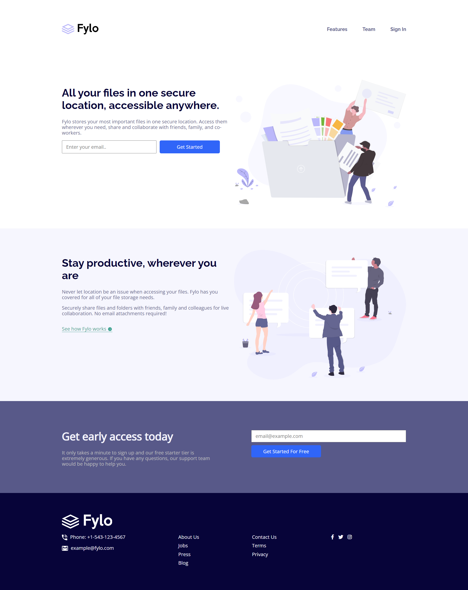
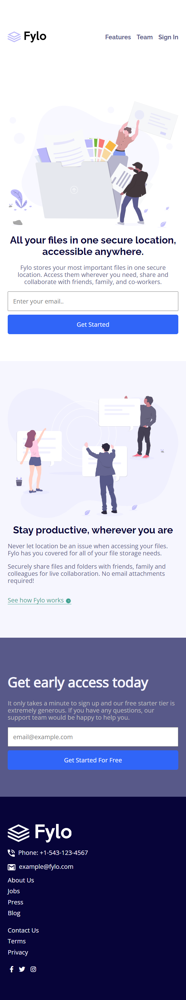

# Frontend Mentor - Fylo landing page with two column layout solution

This is a solution to the [Fylo landing page with two column layout challenge on Frontend Mentor](https://www.frontendmentor.io/challenges/fylo-landing-page-with-two-column-layout-5ca5ef041e82137ec91a50f5). Frontend Mentor challenges help you improve your coding skills by building realistic projects.

## Table of contents

-   [Overview](#overview)
    -   [The challenge](#the-challenge)
    -   [Screenshot](#screenshot)
    -   [Links](#links)
-   [My process](#my-process)
    -   [Built with](#built-with)
    -   [What I learned](#what-i-learned)
-   [Author](#author)

## Overview

### The challenge

Users should be able to:

-   View the optimal layout for the site depending on their device's screen size
-   See hover states for all interactive elements on the page

### Screenshot

|                 Desktop Version                 |                 Mobile Version                 |
| :---------------------------------------------: | :--------------------------------------------: |
|  |  |

### Links

-   [Solution URL](https://github.com/ywsoliman/fylo-landing-page)
-   [Live Site URL](https://ywsoliman.github.io/fylo-landing-page)

## My process

### Built with

-   Semantic HTML5 markup
-   CSS custom properties
    -   Flexbox
    -   Grid

### What I learned

CSS Selectors

```css
form input[type="email"],
form input[type="submit"] {
    ...;
}
.fylo-hover > p:hover + .fylo-box {
    ...;
}
```

## Author

-   Frontend Mentor - [@ywsoliman](https://www.frontendmentor.io/profile/ywsoliman)
-   Linkedin - [@ywsoliman](https://www.linkedin.com/in/ywsoliman/)
